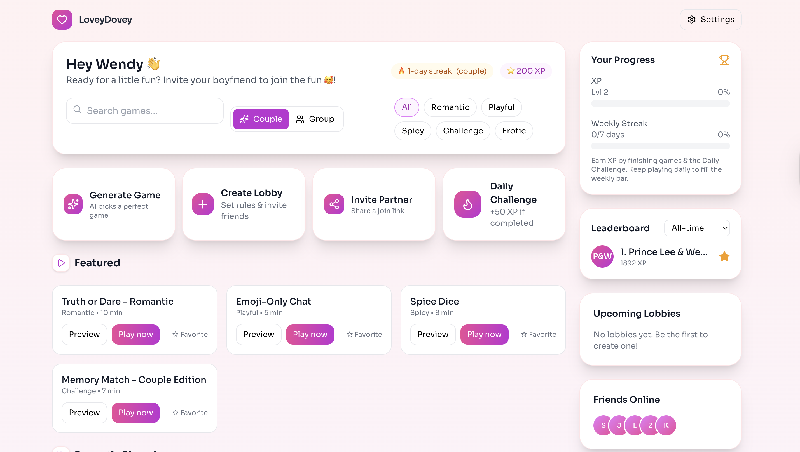

**LoveyDovey — AI Party Games for Couples & Friends**

Playful, real-time games for couples and groups. AI-generated prompts, streaks & XP, leaderboards, and live lobbies.

Replace the image above with your own: docs/screenshots/hero.png.

Table of Contents

Features

Screenshots

Tech Stack

Architecture

Quick Start

Backend (Laravel)

Frontend (React + Vite)

Environment Variables

Real-time (Pusher / Echo)

OpenAI (Structured Outputs + Cache)

Core Flows

API Overview

Run & Scripts

Deploy

Troubleshooting

Contributing

License

Features

🎮 Games: Truth or Dare, Emoji-Chat (timer), Spice Dice, Memory Match, Trivia, Charades (AI prompts)

💞 Couple mode: link partner via invite code, play real-time sessions, shared history & streak

💬 Group lobbies: presence, chat, host starts trivia/charades

🧠 AI content: OpenAI structured JSON + Redis caching

📈 Progression: XP, levels, daily challenge, streaks, leaderboards

✅ Admin: manage users, deactivate accounts (example panel)

✨ UI: sleek, responsive, animated (Tailwind + Framer Motion)

Screenshots

Put your images in docs/screenshots/ and update names below.

Screen	Image
Dashboard	

Onboarding	

Couple Session	

Lobby	

Leaderboard	
Tech Stack

Frontend

React + TypeScript + Vite

Tailwind CSS, Framer Motion, lucide-react

Axios, React Router, Laravel Echo (Pusher)

Backend

Laravel 12 (PHP 8.2+)

Sanctum (token auth), Redis, MySQL/Postgres

Broadcasting (Pusher or Laravel WebSockets)

OpenAI (structured outputs)

Architecture
/frontend        # React app (Vite)
/api             # Laravel app (REST + Broadcast)
docs/
  screenshots/   # images for README

High level

Client obtains a PAT (Sanctum) → calls API

Couple sessions: backend creates game_sessions { code }, broadcasts invites → both clients join presence:couple-session.{code} via Echo

AI content generated server-side with structured outputs, cached in Redis

Quick Start
Backend (Laravel)
cd api
cp .env.example .env
# Edit DB_*, REDIS_*, APP_URL, BROADCAST_DRIVER, PUSHER_*, OPENAI_API_KEY
composer install
php artisan key:generate
php artisan migrate
php artisan serve  # http://127.0.0.1:8000

If using Sanctum with cookies, configure SANCTUM_STATEFUL_DOMAINS.
If using bearer tokens (recommended for SPA), return a token on login and set it in Authorization: Bearer ....

Frontend (React + Vite)
cd ../frontend
cp .env.example .env
# Set VITE_API_URL and VITE_API_BASE_URL to your API
# Set VITE_PUSHER_* if using cloud Pusher
npm i
npm run dev   # http://localhost:5173

Environment Variables

Frontend (/frontend/.env)

Key	Example	Notes
VITE_API_URL	http://127.0.0.1:8000	base browser URL to API (no /api)
VITE_API_BASE_URL	http://127.0.0.1:8000/api	axios base path
VITE_PUSHER_APP_KEY	xxxx	required for Echo (cloud)
VITE_PUSHER_APP_CLUSTER	mt1	cloud cluster
VITE_PUSHER_SCHEME	https	cloud scheme

Backend (/api/.env)

Key	Example
APP_URL	http://127.0.0.1:8000
DB_*	…
REDIS_*	…
BROADCAST_DRIVER	pusher
PUSHER_APP_ID / KEY / SECRET	xxxx
PUSHER_APP_CLUSTER	mt1
PUSHER_SCHEME	https
OPENAI_API_KEY	sk-...
Real-time (Pusher / Echo)

Frontend src/libs/echo.ts (cloud example)

import Echo from 'laravel-echo';
import Pusher from 'pusher-js';
(window as any).Pusher = Pusher;

export const echo = new Echo({
  broadcaster: 'pusher',
  key: import.meta.env.VITE_PUSHER_APP_KEY,
  cluster: import.meta.env.VITE_PUSHER_APP_CLUSTER || 'mt1',
  forceTLS: import.meta.env.VITE_PUSHER_SCHEME === 'https',
  authorizer: (channel) => ({
    authorize: (socketId, cb) => {
      fetch(`${import.meta.env.VITE_API_URL}/broadcasting/auth`, {
        method: 'POST',
        headers: {
          'Content-Type': 'application/json',
          'Authorization': `Bearer ${localStorage.getItem('auth_token') || ''}`,
          'X-Requested-With': 'XMLHttpRequest',
        },
        body: JSON.stringify({ socket_id: socketId, channel_name: channel.name }),
      }).then(async r => cb(r.ok, await r.json()))
        .catch(err => cb(false, err));
    },
  }),
});

OpenAI (Structured Outputs + Cache)

Controllers call OpenAI with JSON schema so the model returns strongly typed prompts (truths/dares, charades cards, etc.)

Redis caches by (kind, difficulty, locale, seed) to avoid repeated calls

Tip: keep generation server-side; clients only request content from your API.

Core Flows
Partner Linking

User A generates invite code → copies & shares

User B inputs code → API validates and links the pair

Either can request unpair; both must confirm to dissolve

Couple Session (2-player)

User A → “Play now” → POST /api/couple-sessions/start { kind }

Backend creates game_sessions row with code, broadcasts invite to private:user.{partnerId}

Both navigate to /session/{code}, join presence:couple-session.{code}

Turns & moves sync via session.updated broadcast

Group Lobby

Create lobby → friends join → chat & presence → host starts a lobby game

API Overview
Method & Path	Purpose
POST /api/auth/register / POST /api/auth/login	returns token
GET /api/me	current user
POST /api/partner/invites	create invite code
POST /api/partner/accept	accept invite { code }
POST /api/partner/unpair	request to unpair
GET /api/partner	pair status
POST /api/couple-sessions/start	create session { kind }
GET /api/sessions/{code}	fetch session by code
POST /api/sessions/{code}/action	push state/turn updates
POST /api/history	save game result (server computes XP)
GET /api/history/recent	recent games (shared & personal)
GET /api/daily / POST /api/daily/complete	daily challenge
`GET /api/leaderboard/couples?range=week	month
GET /api/streaks	user + couple streak data

All secured endpoints require Authorization: Bearer <token>.

Run & Scripts

Frontend

npm run dev
npm run build
npm run preview

Backend

php artisan serve
php artisan migrate
php artisan queue:work     # if using queued broadcasts or jobs

Deploy

Frontend: Vercel/Netlify

Set all VITE_* variables in project settings

Rebuild after updates

Backend: Forge, Vapor, or any PHP host

Set APP_URL, DB/Redis, OpenAI, Pusher; run php artisan migrate --force

Configure CORS and Sanctum for your frontend domain

Enable queues for broadcasts/jobs (if used)

Troubleshooting

Blank page + “You must pass your app key”
Missing VITE_PUSHER_APP_KEY in your frontend env or not redeployed.

WebSocket failed (ws://127.0.0.1:6001)
You pointed Echo to local WS settings but are using cloud Pusher. Remove wsHost/wsPort, set forceTLS and cluster.

403 on /broadcasting/auth
Ensure you send Authorization: Bearer <token> in Echo authorizer.

CSRF mismatch
Use token auth (PAT) for SPA; don’t send CSRF.

404 /api/sessions/{code}
Make sure the GameSession model sets getRouteKeyName() to 'code', and you created the session via /couple-sessions/start.

Timers too fast
Always compute remaining from fixed endAt = Date.now() + minutes*60*1000; and tick every 1000ms.

Contributing

Fork & branch (feat/...)

Keep PRs focused; include screenshots for UI changes

Follow ESLint/Prettier and Laravel Pint defaults

Add tests where sensible

License

MIT © You.
Logo, brand names, and example content belong to their respective owners.

Badges (optional)

Add build/test or deploy badges here once you wire CI:

Image Guide

Place images in docs/screenshots/

Use descriptive names: dashboard.png, session.png, leaderboard.png

Reference via: 

Happy building & playing! 💜